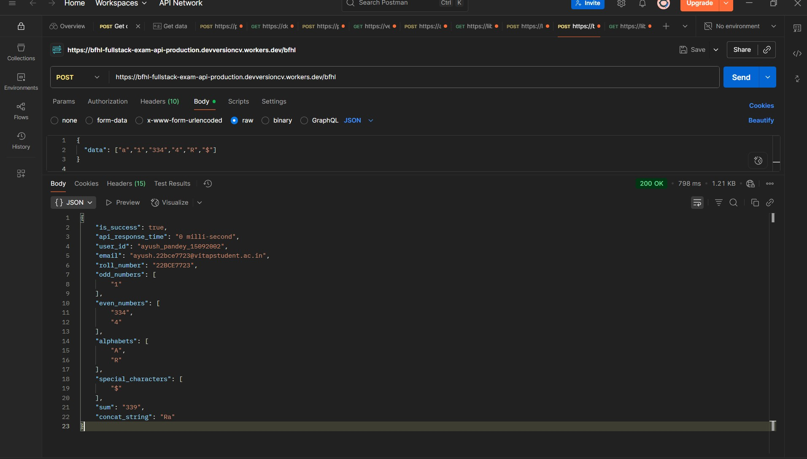

## 👤 Candidate Information

**Name:** Ayush Pandey  
**Registration Number:** 22BCE7723  
**LinkedIn:** [https://www.linkedin.com/in/linkedap/](https://www.linkedin.com/in/linkedap/)  
**College Email:** ayush.22bce7723@vitapstudent.ac.in  
**Personal Emails:** 
- inbox.ayushpandey@gmail.com
- ayushpandey.cs@gmail.com

**Institution:** Vellore Institute of Technology - Amaravati


### A high-performance REST API built on Cloudflare's Global Edge Network, designed for the Bajaj Full Stack Exam.

Endpoint of the API
```
https://bfhl-fullstack-exam-api-production.devversioncv.workers.dev/bfhl
```
## 🌟 Features

- **Global Edge Deployment**: Deployed across Cloudflare's worldwide network of 300+ edge locations
- **Exceptional Performance**: p99 latency of 0 milliseconds (worst case)
- **DDoS Protection**: Durable Object-based rate limiting with 2-second cooling period between requests
- **High Concurrency**: Capable of handling 30-40k concurrent requests (even more with globally distributed users)
- **Future-Ready**: Architecture prepared for JWT implementation

### POST /bfhl

Processes an array of data and returns separated numbers, letters, and other information.

**Request:**
```json
{
  "data": ["1", "334", "4", "A", "R", "$"]
}
```
Response:
```
json
{"is_success":true,
"api_response_time":"0 milli-second",
"user_id":"ayush_pandey_15092002",
"email":"ayush.22bce7723@vitapstudent.ac.in",
"roll_number":"22BCE7723",
"odd_numbers":["1"],
"even_numbers":["334","4"],
"alphabets":["A","R"],
"special_characters":["$"],
"sum":"339",
"concat_string":"Ra"}
```

Test with cURL
```
bash
curl -X POST https://bfhl-fullstack-exam-api-production.devversioncv.workers.dev/bfhl \
  -H "Content-Type: application/json" \
  -d '{
  "data": ["1", "334", "4", "A", "R", "$"]
  }'
```


## 🚀 Performance & Scaling

- **Free Tier Limits**: 100,000 requests/day (Cloudflare Workers free plan)
- **Concurrent Requests**: Practically handles 30,000-40,000 concurrent connections even more if the request distributed worldwide.
- **Global Distribution**: Enhanced performance worldwide due to edge network deployment
- **Zero Cold Starts**: Instant response times across all regions due to V8 isolate based runtime.

## 🔒 Rate Limiting & Security

- **Durable Object Rate Limiter**: Prevents DDoS attacks effectively
- **Cooling Period**: 2 seconds enforced between requests from same origin
- **Automatic Scaling**: No manual intervention required for traffic spikes

## 🛠️ Technical Stack
Runtime: Cloudflare Workers

Storage: Cloudflare Durable Objects (for rate limiting)

Network: Cloudflare Global Edge Network

Language: JavaScript

## 🧪 Testing
The API has been thoroughly tested using Postman:

Normal API Request Test
<p align="center">  </p>
Edge Case Testing
<p align="center">  </p>
Rate Limiter Verification
<p align="center">  </p>


## 📈 Future Enhancements
JWT-based authentication ready for implementation

📄 License
This project is created for Bajaj Full Stack Exam submission.
